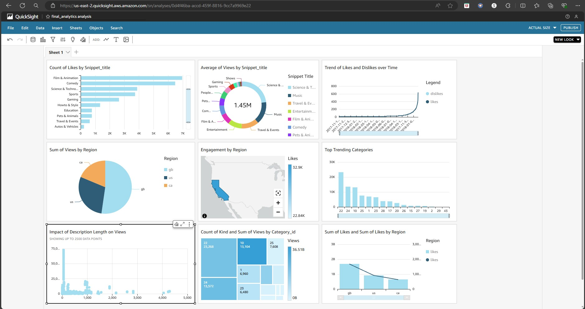

# Youtube-Data-Analysis

## Summary

The project involves ingesting structured and unstructured data, transforming it into a proper format, storing it in a centralized data lake, ensuring scalability, and leveraging cloud services. The final goal is to create a Power BI dashboard for insightful analytics using data stored in Amazon Athena.

## Project Goals:

1. **Data Ingestion:** Build a mechanism to ingest data from different sources.
2. **ETL System:** Transform raw data into the proper format.
3. **Data Lake:** Centralized repository for data from multiple sources.
4. **Cloud:** Use AWS for processing vast amounts of data.
5. **Reporting:** Build a Power BI dashboard for insights.

## Services Used:

1. **Amazon S3**
2. **AWS IAM**
3. **AWS Glue**
4. **AWS Lambda**
5. **AWS Athena**
6. **AWS QuickSight**

## Project Flow:

1. Download the YouTube dataset from Kaggle, upload the dataset to an Amazon S3 bucket using AWS CLI.
2. Use AWS Glue Crawler to crawl through the data (CSV & JSON), create a Data Catalog and store it in a new database.
3. Create a new S3 bucket to store AWS Athena query results.
4. Use AWS Lambda functions to convert JSON and CSV files to Parquet format for basic data cleaning and storing the cleaned data into a new bucket.
5. Ensure the data is ready for querying with Athena.
6. Build a trigger to automatically execute the Lambda function upon any updates or deletions in the S3 bucket.
7. Use AWS Glue Studio to build an ETL pipeline.Perform transformations on the cleaned S3 bucket data. Store the transformed data in the final analytical bucket for analysis.
8. Connect QuickSight to AWS Athena. Create a dashboard in QuickSight to visualize and analyze the data.

## Dataset Used: https://www.kaggle.com/datasets/datasnaek/youtube-new

## Architecture Diagram:

## AWS QuickSight Dashboard:

